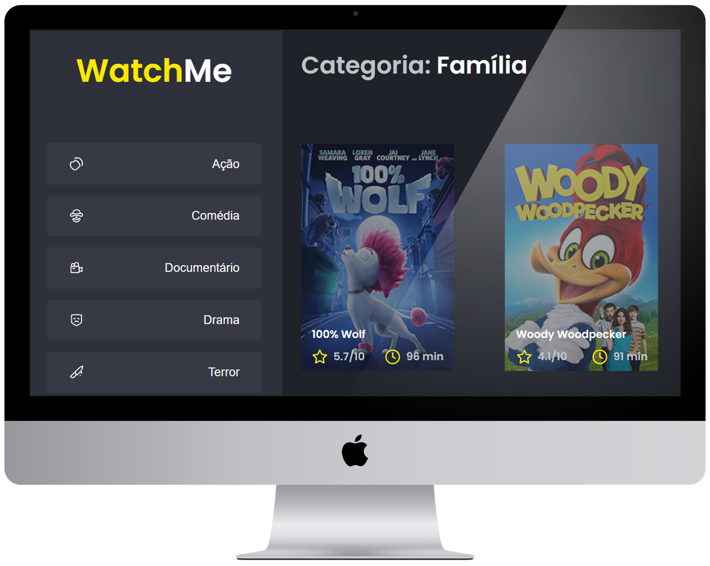

<h1 align="center">
    <strong style="color: yellow">Watch</strong><strong>Me</strong>
</h1>

<p align="center">
  <a href="#-projeto">Projeto</a>&nbsp;&nbsp;&nbsp;|&nbsp;&nbsp;&nbsp;
  <a href="#-ambiente">Ambiente</a>&nbsp;&nbsp;&nbsp;|&nbsp;&nbsp;&nbsp;
  <a href="#%EF%B8%8F-licença">License</a>&nbsp;&nbsp;&nbsp;
</p>
<br>

<p align="center">
   
</p>
<p align="center">
     
</p>


<br>

<p align="center">
 
</p>

## 💻 Projeto

Segundo desafio realizado no curso Ignite da [Rocketseat](https://rocketseat.com.br/).

Após clonar o template, era necessário fazer componentização dos componentes:

- SideBar.
- Content.

## 📝 Ambiente

1. Clonar o repositório:

```bash
git@github.com:CaioLemec/desafio-react02-ignite.git
```

2. Instale as dependências usando o comando:

```bash
 yarn
```

3. No seu terminal use o comando para rodar o server:

```bash
yarn server
```

3. No seu terminal use o comando para rodar a aplicação:

```bash
yarn dev
```

4. acesse o endereço em um browser compatível:

```bash
http://localhost:8080/
```

## ⚖️ Licença

Projeto licenciado por MIT [LICENSE](./LICENSE).
